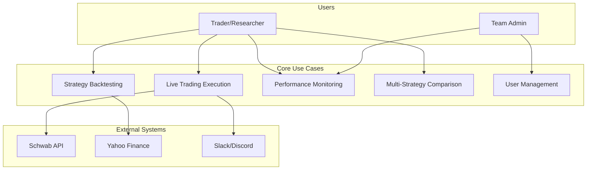
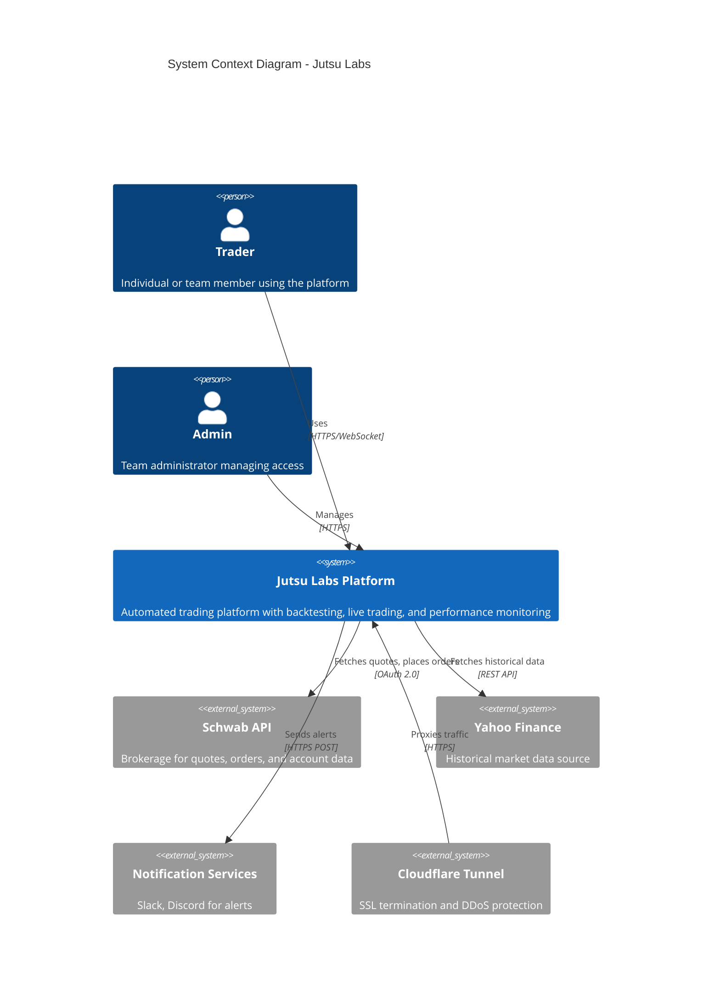

# System Overview

> High-level architectural context for the Jutsu Labs automated trading platform

**Version:** 1.0
**Last Updated:** January 25, 2026
**Status:** Production
**Document Type:** Architecture Overview (C4 Context Level)

---

## Table of Contents

1. [System Goals and Non-Goals](#1-system-goals-and-non-goals)
2. [Target Users and Use Cases](#2-target-users-and-use-cases)
3. [High-Level Architecture](#3-high-level-architecture)
4. [Technology Stack](#4-technology-stack)
5. [Key Quality Attributes](#5-key-quality-attributes)
6. [Deployment Overview](#6-deployment-overview)
7. [Related Documents](#7-related-documents)

---

## 1. System Goals and Non-Goals

### 1.1 System Goals

Jutsu Labs is an **automated trading platform** designed to bridge the gap between strategy research and live execution. The platform exists because individual traders and small teams face significant challenges:

| Challenge | How Jutsu Labs Addresses It |
|-----------|---------------------------|
| **Fragmented tooling** | Unified backtesting and live trading using identical strategy code |
| **Execution gap** | Same engine runs backtests and live trades—no code translation |
| **Lack of visibility** | Web dashboard with real-time performance, regime analysis, trade history |
| **Complexity barrier** | Pre-built strategies, configuration-driven customization |

**Primary Goals:**

1. **Unified Workflow**: Run the same strategy code in backtesting, paper trading, and production
2. **Transparency**: Full visibility into signals, allocations, and trade rationale
3. **Reliability**: 99.9% uptime with automated execution at precisely 3:55 PM ET
4. **Progressive Safety**: Dry-run → Paper → Production deployment model
5. **Multi-Strategy Tracking**: Compare up to 3 strategies side-by-side with live metrics

### 1.2 Non-Goals

The following are explicitly **not** goals of the current system:

| Non-Goal | Rationale |
|----------|-----------|
| **High-Frequency Trading** | Daily timeframe focus; not designed for sub-second execution |
| **Multi-Broker Support** | Schwab-only integration (IB, Alpaca planned for future) |
| **Options/Crypto Trading** | Equity and ETF focus; derivatives support deferred |
| **Public SaaS Offering** | Self-hosted for individual traders and small teams |
| **Machine Learning Strategies** | Rule-based strategies; ML framework planned for future |
| **Intraday Execution** | End-of-day execution model (3:55 PM ET) |

### 1.3 Design Philosophy

The architecture follows these core principles, inherited from the original "Vibe" backtesting engine:

```
┌─────────────────────────────────────────────────────────────────────────────┐
│                        DESIGN PRINCIPLES                                     │
├─────────────────────────────────────────────────────────────────────────────┤
│                                                                              │
│  1. MODULARITY OVER MONOLITH                                                │
│     Every component (data, strategy, portfolio, metrics) is independent     │
│     and swappable without affecting others                                   │
│                                                                              │
│  2. SIMPLICITY & CLARITY                                                    │
│     Core engine is simple, well-documented, auditable                       │
│     No hidden magic—calculations are transparent                            │
│                                                                              │
│  3. EXPANDABILITY FIRST                                                     │
│     Architecture assumes new data sources, strategies, and analysis         │
│     tools will be added continuously                                        │
│                                                                              │
│  4. TRUSTWORTHY & TRANSPARENT                                               │
│     PnL, drawdown, and metrics are auditable                                │
│     Financial precision with Decimal types (not float)                      │
│                                                                              │
│  5. DATA INTEGRITY                                                          │
│     UTC timestamps, UNIQUE constraints, audit trails                        │
│     Market data is immutable after storage                                  │
│                                                                              │
└─────────────────────────────────────────────────────────────────────────────┘
```

---

## 2. Target Users and Use Cases

### 2.1 Target Users

| Persona | Profile | Primary Needs |
|---------|---------|---------------|
| **Solo Algorithmic Trader** | 3-5 years trading, 1-2 years programming | Simple deployment (Docker), clear metrics, reliable execution |
| **Quantitative Researcher** | 5+ years quant experience, strong programming | Comprehensive backtesting, WFO, Monte Carlo, multi-strategy comparison |
| **Trading Team Admin** | Manages 2-5 person trading operation | Multi-user access, role-based permissions, audit trails |

### 2.2 Primary Use Cases



**Use Case Summary:**

| ID | Use Case | Actor | Key Acceptance Criteria |
|----|----------|-------|------------------------|
| UC-1 | Strategy Backtesting | Trader | < 30s for 10 years of daily data |
| UC-2 | Live Trading Execution | Trader | Orders placed within 5 min of 3:55 PM trigger |
| UC-3 | Performance Monitoring | Trader/Admin | Dashboard loads < 2 seconds |
| UC-4 | Multi-Strategy Comparison | Trader | Up to 3 strategies overlaid on same chart |
| UC-5 | User Invitation | Admin | Max 20 users, 48-hour token expiry |

---

## 3. High-Level Architecture

### 3.1 C4 Context Diagram



### 3.2 Container Diagram

```
┌─────────────────────────────────────────────────────────────────────────────┐
│                          JUTSU LABS PLATFORM                                 │
├─────────────────────────────────────────────────────────────────────────────┤
│                                                                              │
│  ┌──────────────────┐    ┌──────────────────┐    ┌──────────────────┐       │
│  │   WEB DASHBOARD  │    │    REST API      │    │  TRADING ENGINE  │       │
│  │   (React 18)     │◄──►│    (FastAPI)     │◄──►│    (Python)      │       │
│  │                  │    │                  │    │                  │       │
│  │  • Dashboard     │    │  • Auth API      │    │  • Backtesting   │       │
│  │  • Performance   │    │  • Trading API   │    │  • Optimization  │       │
│  │  • Backtest      │    │  • Data API      │    │  • Live Trading  │       │
│  │  • Trades        │    │  • WebSocket     │    │  • Scheduler     │       │
│  │  • Settings      │    │                  │    │                  │       │
│  └──────────────────┘    └──────────────────┘    └──────────────────┘       │
│           │                       │                       │                  │
│           └───────────────────────┼───────────────────────┘                  │
│                                   │                                          │
│                      ┌────────────▼────────────┐                            │
│                      │      DATA LAYER         │                            │
│                      │      (PostgreSQL)       │                            │
│                      │                         │                            │
│                      │  • market_data          │                            │
│                      │  • daily_performance    │                            │
│                      │  • live_trades          │                            │
│                      │  • users/passkeys       │                            │
│                      └─────────────────────────┘                            │
│                                   │                                          │
│                      ┌────────────▼────────────┐                            │
│                      │    EXTERNAL SERVICES    │                            │
│                      │                         │                            │
│                      │  • Schwab API (Broker)  │                            │
│                      │  • Yahoo Finance (Data) │                            │
│                      │  • Slack/Discord (Alerts)│                           │
│                      └─────────────────────────┘                            │
└─────────────────────────────────────────────────────────────────────────────┘
```

### 3.3 Key Architectural Decisions

| Decision | Choice | Rationale | Trade-offs |
|----------|--------|-----------|------------|
| **Monolithic Deployment** | Single Docker container | Simplicity for small teams; easier debugging | Less horizontal scalability |
| **In-Process Scheduler** | APScheduler embedded | No external dependencies; simpler deployment | Must restart to change jobs |
| **Database** | PostgreSQL | Production-grade, multi-user, robust | Requires separate instance |
| **Frontend** | React 18 + TanStack Query | Modern, reactive, strong community | Build complexity |
| **Backend Framework** | FastAPI | Async support, OpenAPI docs, type safety | Smaller ecosystem than Django |

---

## 4. Technology Stack

### 4.1 Technology Summary

```
┌─────────────────────────────────────────────────────────────────────────────┐
│                          TECHNOLOGY STACK                                    │
├─────────────────────────────────────────────────────────────────────────────┤
│                                                                              │
│  FRONTEND                          BACKEND                                   │
│  ────────                          ───────                                   │
│  React 18            Component UI  FastAPI 0.110+     REST API              │
│  TypeScript 5.x      Type safety   Python 3.10+      Trading engine        │
│  Vite 5.x            Build tool    SQLAlchemy 2.0+   ORM                   │
│  TailwindCSS 3.x     Styling       APScheduler 3.x   Job scheduling        │
│  TanStack Query 5.x  Data fetching schwab-py 1.x     Broker integration    │
│                                                                              │
│  DATABASE                          INFRASTRUCTURE                            │
│  ────────                          ──────────────                            │
│  PostgreSQL 15+      Primary DB    Docker 24+        Containerization      │
│  Alembic             Migrations    NGINX             Reverse proxy         │
│                                    Cloudflare        SSL/DDoS              │
│                                                                              │
└─────────────────────────────────────────────────────────────────────────────┘
```

### 4.2 Layer-by-Layer Stack

| Layer | Technology | Version | Purpose |
|-------|------------|---------|---------|
| **Frontend** | React | 18.x | Component-based UI framework |
| | TypeScript | 5.x | Type safety and developer experience |
| | Vite | 5.x | Fast build tooling with HMR |
| | TailwindCSS | 3.x | Utility-first CSS styling |
| | TanStack Query | 5.x | Server state management and caching |
| **Backend API** | FastAPI | 0.110+ | Async REST API with OpenAPI docs |
| | Pydantic | 2.x | Request/response validation |
| | python-jose | - | JWT token handling |
| | slowapi | - | Rate limiting |
| **Trading Engine** | Python | 3.10+ | Core trading logic |
| | pandas | 2.x | Data manipulation and analysis |
| | numpy | 1.x | Numerical computations |
| | schwab-py | 1.x | Schwab API client |
| **Database** | PostgreSQL | 15+ | Primary datastore |
| | SQLAlchemy | 2.0+ | ORM and query building |
| | Alembic | - | Database migrations |
| **Scheduler** | APScheduler | 3.x | In-process job scheduling |
| **Infrastructure** | Docker | 24+ | Container deployment |
| | NGINX | 1.x | Reverse proxy, rate limiting |
| | Cloudflare | - | SSL termination, DDoS protection |

---

## 5. Key Quality Attributes

### 5.1 Quality Attribute Scenarios

| Quality | Scenario | Target | Current Status |
|---------|----------|--------|----------------|
| **Performance** | Dashboard loads | < 2 seconds | < 500ms |
| | API response (simple) | < 200ms | < 100ms |
| | Trade execution | < 5 seconds | < 3 seconds |
| | Backtest (10 years) | < 30 seconds | < 15 seconds |
| **Reliability** | System uptime | 99.9% | 99.9%+ |
| | Trade execution success | 100% | 100% |
| | Position reconciliation | 100% accurate | 100% |
| **Security** | Authentication bypass | 0 vulnerabilities | 0 |
| | SQL injection | 0 vulnerabilities | 0 |
| | Account lockout | After 10 attempts | Implemented |
| **Scalability** | Concurrent users | 20 | Supported |
| | Historical data | 20+ years | Supported |
| | Active strategies | 10 | Supported |

### 5.2 Quality Attribute Trade-offs

```
                      PERFORMANCE
                           │
                           │
              ┌────────────┼────────────┐
              │            │            │
              │    Jutsu Labs Position  │
              │            ●            │
              │            │            │
              │            │            │
   SIMPLICITY ◄────────────┼────────────► FEATURES
              │            │            │
              │            │            │
              │            │            │
              │            │            │
              └────────────┼────────────┘
                           │
                           │
                       SECURITY

Trade-off Decisions:
• Chose in-process scheduler over distributed queue (simplicity > scalability)
• Chose PostgreSQL over time-series DB (ecosystem > specialized performance)
• Chose monolithic deployment over microservices (simplicity > complexity)
• Chose daily execution over intraday (reliability > frequency)
```

### 5.3 Security Architecture Summary

```
┌─────────────────────────────────────────────────────────────────────────────┐
│                        SECURITY CONTROLS                                     │
├─────────────────────────────────────────────────────────────────────────────┤
│                                                                              │
│  LAYER 1: NETWORK                                                           │
│  ─────────────────                                                          │
│  • Cloudflare: DDoS protection, SSL termination, WAF                        │
│  • NGINX: Rate limiting (5 req/min), security headers, HSTS                 │
│                                                                              │
│  LAYER 2: AUTHENTICATION                                                    │
│  ───────────────────────                                                    │
│  • Password: bcrypt (12 rounds) with rate limiting                          │
│  • 2FA: TOTP (6-digit codes) with backup codes                              │
│  • Passkeys: WebAuthn/FIDO2 for passwordless login                          │
│  • JWT: HS256 tokens (15 min access, 7 day refresh)                         │
│                                                                              │
│  LAYER 3: AUTHORIZATION                                                     │
│  ──────────────────────                                                     │
│  • Roles: Admin (full access), Viewer (read-only)                           │
│  • Endpoint protection: Role-based decorators on all routes                 │
│  • Account lockout: 10 failed attempts triggers temporary lockout           │
│                                                                              │
│  LAYER 4: DATA                                                              │
│  ─────────────                                                              │
│  • Encrypted secrets: Fernet encryption for Schwab tokens                   │
│  • Parameterized queries: SQLAlchemy ORM prevents injection                 │
│  • Input validation: Pydantic schemas on all endpoints                      │
│                                                                              │
└─────────────────────────────────────────────────────────────────────────────┘
```

---

## 6. Deployment Overview

### 6.1 Deployment Architecture

```
┌─────────────────────────────────────────────────────────────────────────────┐
│                      PRODUCTION DEPLOYMENT                                   │
├─────────────────────────────────────────────────────────────────────────────┤
│                                                                              │
│  Internet ────► Cloudflare ────► NGINX ────► Docker Container               │
│                 (SSL/DDoS)       (Rate limit)                               │
│                                                                              │
│  ┌─────────────────────────────────────────────────────────────────────┐    │
│  │                      DOCKER HOST                                     │    │
│  │                                                                       │    │
│  │   ┌───────────────────────────────────────────────────────────┐     │    │
│  │   │  jutsu-labs:latest                                        │     │    │
│  │   │                                                            │     │    │
│  │   │  • FastAPI backend (:8000)                                │     │    │
│  │   │  • React dashboard (:3000 → served by FastAPI)            │     │    │
│  │   │  • APScheduler (in-process)                               │     │    │
│  │   │                                                            │     │    │
│  │   └───────────────────────────────────────────────────────────┘     │    │
│  │                              │                                        │    │
│  │                              ▼                                        │    │
│  │   ┌───────────────────────────────────────────────────────────┐     │    │
│  │   │  PostgreSQL 15 (separate container or host)               │     │    │
│  │   │  • Database: jutsu_labs                                   │     │    │
│  │   │  • Daily backups                                           │     │    │
│  │   └───────────────────────────────────────────────────────────┘     │    │
│  │                                                                       │    │
│  └─────────────────────────────────────────────────────────────────────┘    │
│                                                                              │
└─────────────────────────────────────────────────────────────────────────────┘
```

### 6.2 Key Environment Variables

| Variable | Description | Required |
|----------|-------------|----------|
| `DATABASE_TYPE` | `postgresql` or `sqlite` | Yes |
| `POSTGRES_HOST` | Database host | If PostgreSQL |
| `SECRET_KEY` | JWT signing key (256-bit) | Yes |
| `ADMIN_PASSWORD` | Initial admin password | Yes |
| `SCHWAB_API_KEY` | Schwab OAuth API key | For live trading |
| `SCHWAB_APP_SECRET` | Schwab OAuth secret | For live trading |
| `AUTH_REQUIRED` | Enable authentication | Yes (default: `true`) |

### 6.3 Deployment Checklist

- [ ] PostgreSQL database provisioned and accessible
- [ ] Environment variables configured in `.env` or Docker secrets
- [ ] Cloudflare tunnel configured with SSL
- [ ] NGINX reverse proxy with rate limiting
- [ ] Schwab OAuth tokens initialized (if live trading)
- [ ] Admin account created with strong password
- [ ] 2FA enabled on admin account
- [ ] Backup schedule configured

---

## 7. Related Documents

### 7.1 Architecture Document Series

| Document | Description | Status |
|----------|-------------|--------|
| **00_SYSTEM_OVERVIEW.md** | This document - high-level context | Complete |
| [01_DOMAIN_MODEL.md](./01_DOMAIN_MODEL.md) | Business domain concepts | Planned |
| [02_DATA_LAYER.md](./02_DATA_LAYER.md) | Database schema, data flow | Planned |
| [03_FUNCTIONAL_CORE.md](./03_FUNCTIONAL_CORE.md) | Core algorithms, EventLoop | Planned |
| [04_BOUNDARIES.md](./04_BOUNDARIES.md) | APIs, integrations | Planned |
| [05_LIFECYCLE.md](./05_LIFECYCLE.md) | Request flows, state transitions | Planned |
| [06_WORKERS.md](./06_WORKERS.md) | Scheduler, background jobs | Planned |
| [07_INTEGRATION_PATTERNS.md](./07_INTEGRATION_PATTERNS.md) | Cross-cutting patterns, ADRs | Planned |

### 7.2 External References

| Document | Location | Description |
|----------|----------|-------------|
| Product Requirements | `docs/PRD.md` | Functional requirements, user stories |
| Developer Guide | `README.developer.md` | Development setup, contribution guidelines |
| Changelog | `CHANGELOG.md` | Version history and release notes |
| API Reference | Generated from OpenAPI | REST API documentation |

### 7.3 Glossary

| Term | Definition |
|------|------------|
| **Regime** | Market state classification (Bull/Bear × Low/Normal/High volatility) |
| **6-Cell Matrix** | Grid of 6 regime states determining allocation strategy |
| **EventLoop** | Bar-by-bar simulation coordinator preventing lookahead bias |
| **Strategy** | Trading algorithm that generates buy/sell signals |
| **Allocation** | Target portfolio weights for each asset class |
| **Baseline** | QQQ buy-and-hold benchmark for comparison |
| **V2 API** | New daily performance API with EOD aggregation |

---

## Appendix A: Evolution History

### A.1 Major Milestones

| Version | Date | Key Changes |
|---------|------|-------------|
| 1.0 | Nov 2025 | Initial MVP with backtesting and CLI |
| 2.0 | Dec 2025 | Live trading, web dashboard |
| 3.0 | Jan 2026 | Multi-user auth, passkeys, PostgreSQL |
| 4.0 | Jan 2026 | Multi-strategy tracking, V2 API, RBAC |

### A.2 Architecture Evolution

```
Nov 2025                    Dec 2025                    Jan 2026
────────                    ────────                    ────────

CLI + SQLite               + FastAPI                   + Multi-User
     │                     + React Dashboard           + PostgreSQL
     │                     + Live Trading              + V2 API
     ▼                          │                          │
┌─────────┐               ┌─────────┐               ┌─────────┐
│ Library │  ──────────►  │ Monolith │ ──────────►  │ Platform │
│   Only  │               │ + Web UI │               │  + RBAC  │
└─────────┘               └─────────┘               └─────────┘
```

---

*Document generated following Arc42 and C4 Model conventions.*
