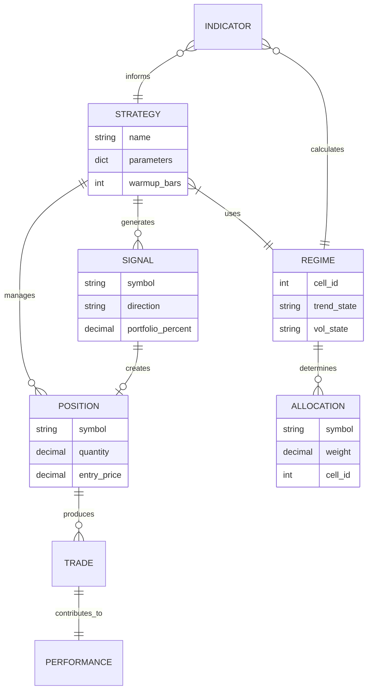
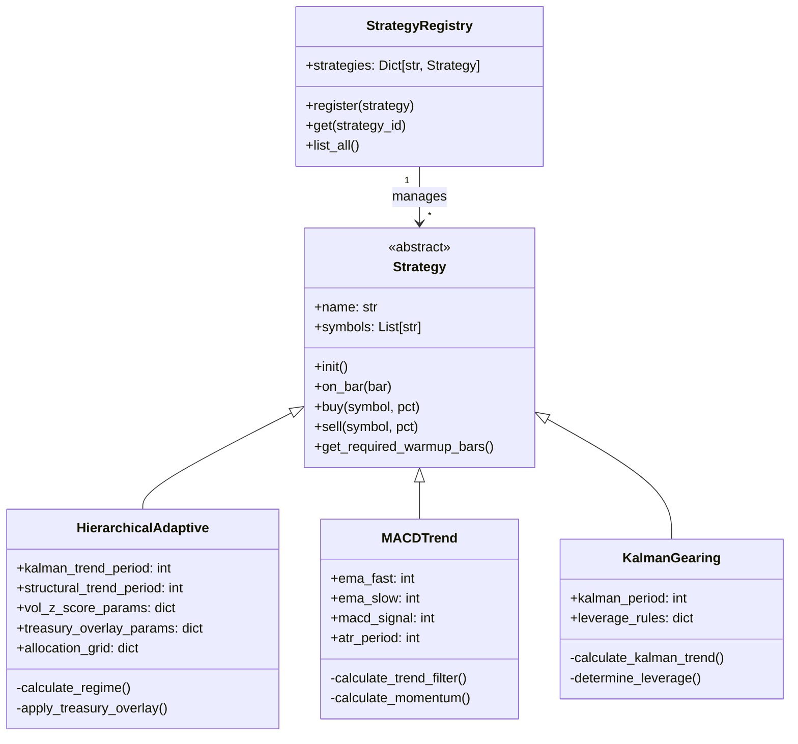
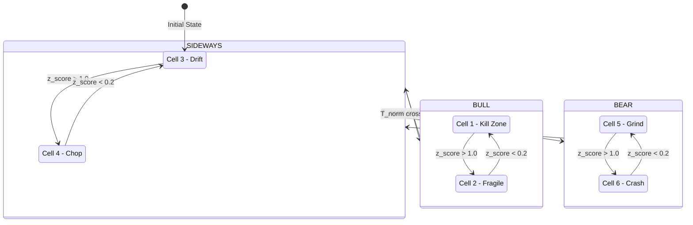
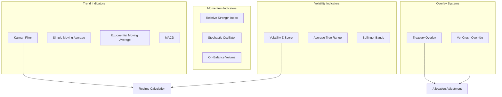
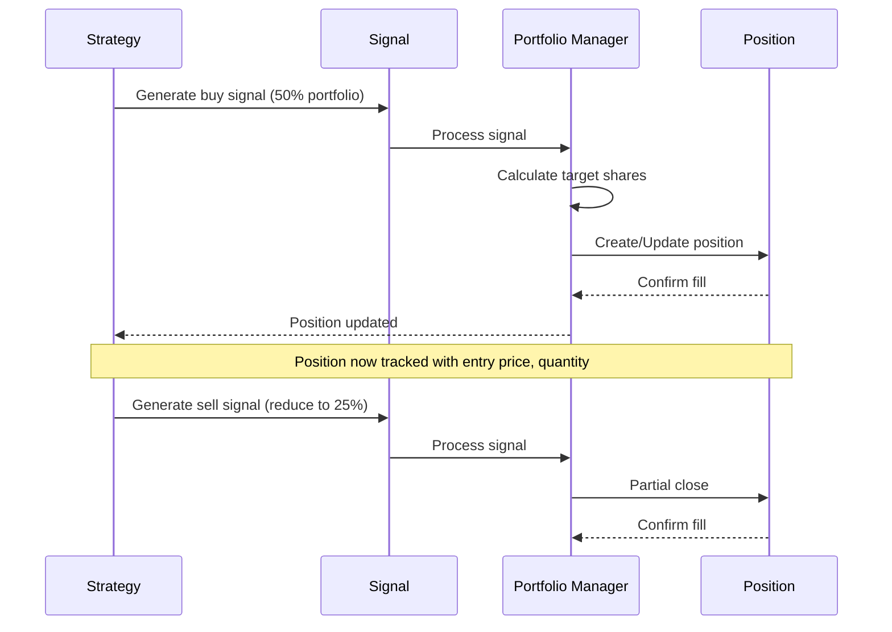

# 01 - Domain Model

> Core business domain concepts, relationships, and trading terminology for Jutsu Labs

**Last Updated**: 2026-01-25
**Version**: 1.0
**Status**: Active

---

## Table of Contents

1. [Overview](#overview)
2. [Trading Domain Concepts](#trading-domain-concepts)
3. [Strategy Architecture](#strategy-architecture)
4. [Market Regime System](#market-regime-system)
5. [Indicator Taxonomy](#indicator-taxonomy)
6. [Symbol Sets and Asset Classes](#symbol-sets-and-asset-classes)
7. [Position and Allocation Model](#position-and-allocation-model)
8. [Performance Metrics](#performance-metrics)
9. [Glossary](#glossary)
10. [Related Documents](#related-documents)

---

## Overview

The Jutsu Labs domain model defines the core business concepts for algorithmic trading strategy development, backtesting, and live execution. The model is built around three pillars:

1. **Strategies**: Algorithmic trading logic that generates buy/sell signals
2. **Regimes**: Market state classification determining allocation behavior
3. **Indicators**: Technical calculations providing market insights

### Domain Boundaries

```
┌─────────────────────────────────────────────────────────────────────┐
│                        TRADING DOMAIN                               │
├─────────────────────────────────────────────────────────────────────┤
│  ┌──────────────┐  ┌──────────────┐  ┌──────────────┐              │
│  │  Strategies  │  │   Regimes    │  │  Indicators  │              │
│  │              │  │              │  │              │              │
│  │ - Base Class │  │ - 6-Cell     │  │ - Trend      │              │
│  │ - Families   │  │   Matrix     │  │ - Volatility │              │
│  │ - Registry   │  │ - States     │  │ - Momentum   │              │
│  └──────┬───────┘  └──────┬───────┘  └──────┬───────┘              │
│         │                 │                 │                       │
│         └─────────────────┼─────────────────┘                       │
│                           ▼                                         │
│  ┌─────────────────────────────────────────────────────────────┐   │
│  │                    Signal Generation                         │   │
│  │         Strategy + Regime + Indicators → Trade Signal        │   │
│  └─────────────────────────────────────────────────────────────┘   │
│                           │                                         │
│         ┌─────────────────┼─────────────────┐                       │
│         ▼                 ▼                 ▼                       │
│  ┌──────────────┐  ┌──────────────┐  ┌──────────────┐              │
│  │  Positions   │  │ Allocations  │  │  Performance │              │
│  └──────────────┘  └──────────────┘  └──────────────┘              │
└─────────────────────────────────────────────────────────────────────┘
```

---

## Trading Domain Concepts

### Core Entities

| Entity | Description | Primary Attributes |
|--------|-------------|-------------------|
| **Strategy** | Algorithm generating trade signals | name, parameters, warmup_bars |
| **Regime** | Market state classification | trend_state, vol_state, cell_id |
| **Position** | Current holding in a symbol | symbol, quantity, entry_price |
| **Allocation** | Target portfolio distribution | symbol, weight, cell_mapping |
| **Signal** | Buy/sell instruction | symbol, direction, portfolio_percent |
| **Bar** | OHLCV price data point | timestamp, open, high, low, close, volume |

### Entity Relationships



---

## Strategy Architecture

### Strategy Base Class

All trading strategies inherit from the abstract `Strategy` base class, which provides:

```python
class Strategy(ABC):
    """Abstract base class for all trading strategies."""

    def __init__(self, name: str, symbols: List[str]):
        self.name = name
        self.symbols = symbols
        self._bars: Dict[str, List[Bar]] = {}
        self._positions: Dict[str, Position] = {}
        self._signals: List[SignalEvent] = []

    @abstractmethod
    def init(self) -> None:
        """Initialize strategy (called once before backtest)."""
        pass

    @abstractmethod
    def on_bar(self, bar: Bar) -> None:
        """Process new bar data and generate signals."""
        pass

    def get_required_warmup_bars(self) -> int:
        """Return minimum bars needed before trading."""
        return 0

    def buy(self, symbol: str, portfolio_percent: Decimal,
            price: Optional[Decimal] = None) -> None:
        """Generate buy signal with portfolio percentage allocation."""
        # Validates 0.0 <= portfolio_percent <= 1.0
        # Creates SignalEvent with LONG direction
        pass

    def sell(self, symbol: str, portfolio_percent: Decimal,
             price: Optional[Decimal] = None) -> None:
        """Generate sell signal to reduce/exit position."""
        pass
```

### Strategy Type Hierarchy



### Strategy Families

| Family | Versions | Core Approach | Primary Symbols |
|--------|----------|---------------|-----------------|
| **Hierarchical Adaptive** | v1 → v5.1 | 6-cell regime matrix with Kalman trend | QQQ, TQQQ, PSQ, TMF, TMV |
| **MACD Trend** | v1 → v6 | EMA crossover + MACD momentum | TQQQ, QQQ, Cash |
| **Kalman Gearing** | v1 → v2 | Kalman-based leverage switching | QQQ, TQQQ, SQQQ |

### Strategy Registry Pattern

The multi-strategy system uses a central registry for strategy management:

```python
# Strategy Registration
STRATEGY_REGISTRY = {
    "hierarchical_adaptive_v3_5b": HierarchicalAdaptiveV3_5b,
    "hierarchical_adaptive_v5_1": HierarchicalAdaptiveV5_1,
    "macd_trend_v4": MACDTrendV4,
    "macd_trend_v6": MACDTrendV6,
    "kalman_gearing_v2": KalmanGearingV2,
}

# Database: strategy_id column links performance data
performance_snapshots.strategy_id → STRATEGY_REGISTRY key
live_trades.strategy_id → STRATEGY_REGISTRY key
```

---

## Market Regime System

### 6-Cell Regime Matrix

The core regime classification uses a 3×2 matrix combining trend state and volatility state:

```
                    │    Low Volatility     │    High Volatility    │
────────────────────┼───────────────────────┼───────────────────────┤
  BULL (T_norm > 0.3)│ Cell 1: Kill Zone    │ Cell 2: Fragile       │
                    │ 60% TMF, 40% QQQ      │ 100% QQQ              │
────────────────────┼───────────────────────┼───────────────────────┤
  SIDEWAYS          │ Cell 3: Drift         │ Cell 4: Chop          │
  (-0.3 ≤ T ≤ 0.3)  │ 20% TMF, 80% QQQ      │ 100% Cash             │
────────────────────┼───────────────────────┼───────────────────────┤
  BEAR (T_norm<-0.3)│ Cell 5: Grind         │ Cell 6: Crash         │
                    │ 50% QQQ, 50% Cash     │ 100% Cash (or PSQ)    │
────────────────────┴───────────────────────┴───────────────────────┘
```

### Regime State Machine



### Trend Detection

Trend state is determined by the normalized trend score (T_norm):

```
T_norm = weighted_average(
    Kalman_trend_signal,      # Short-term (6-day)
    Structural_trend_signal   # Medium-term (4-week)
)

Classification:
  T_norm > +0.3  → BULL (BullStrong)
  T_norm < -0.3  → BEAR (BearStrong)
  otherwise      → SIDEWAYS
```

### Volatility Detection

Volatility state uses a Z-score with hysteresis to prevent oscillation:

```
Z-Score Calculation:
  σ_t = realized_volatility(21 days)
  μ_vol = mean(σ, 126 days)
  σ_vol = std(σ, 126 days)
  z_score = (σ_t - μ_vol) / σ_vol

Hysteresis State Machine:
  ┌─────────────────────────────────────────────┐
  │                                             │
  │   LOW_VOL ◄─────── z < 0.2 ──────► HIGH_VOL │
  │      │                                 │    │
  │      │          DEADBAND               │    │
  │      │        (0.2 to 1.0)             │    │
  │      │        No transitions           │    │
  │      │                                 │    │
  │      └───────── z > 1.0 ───────────────┘    │
  │                                             │
  └─────────────────────────────────────────────┘

Result: ~15 rebalances/year (vs ~50 without hysteresis)
```

### Regime Authority

Per architecture decision (2026-01-14):

| Component | Regime Authority | Data Written |
|-----------|------------------|--------------|
| **Scheduler (Live)** | Authoritative | strategy_cell, trend_state, vol_state |
| **Backtest Refresh** | Read-only | P/L metrics only |
| **Dashboard** | Consumer | Displays scheduler's regime |

---

## Indicator Taxonomy

### Indicator Categories



### Core Indicators

| Indicator | Purpose | Parameters | Output |
|-----------|---------|------------|--------|
| **Kalman Filter** | Smooth trend detection | period=6 | Normalized trend signal [-1, +1] |
| **SMA Crossover** | Structural trend | fast=20, slow=60 | Bull/Bear/Neutral |
| **Volatility Z-Score** | Regime volatility | window=21, baseline=126 | Z-score value |
| **MACD** | Momentum signal | fast=12, slow=26, signal=9 | Histogram value |
| **ATR** | Position sizing | period=14 | Average true range |
| **RSI** | Overbought/oversold | period=14 | 0-100 scale |

### Treasury Overlay

The Treasury Overlay adjusts defensive allocations based on bond market trends:

```
TLT Trend Detection:
  tlt_sma_fast = SMA(TLT, 20)
  tlt_sma_slow = SMA(TLT, 60)

  if tlt_sma_fast > tlt_sma_slow:
      bond_instrument = TMF  # 3x Long Bonds
  else:
      bond_instrument = TMV  # 3x Short Bonds

Application:
  - Applies to defensive cells (3, 4, 5, 6)
  - max_bond_weight = 0.4 (40% maximum)
  - Replaces cash allocation with selected bond instrument
```

### Vol-Crush Override

Detects rapid volatility compression for early regime transition:

```
Trigger Conditions:
  1. High volatility state currently active
  2. Z-score drops >50% in 3 days
  3. Absolute z-score < 0.5

Action:
  - Force transition to low volatility state
  - Bypass normal hysteresis rules
  - Prevents "stuck in crash mode" during recovery
```

---

## Symbol Sets and Asset Classes

### Primary Trading Universe

| Symbol | Type | Leverage | Description |
|--------|------|----------|-------------|
| **QQQ** | Equity ETF | 1x | Nasdaq-100 Index |
| **TQQQ** | Leveraged ETF | 3x Long | ProShares UltraPro QQQ |
| **SQQQ** | Leveraged ETF | 3x Short | ProShares UltraPro Short QQQ |
| **PSQ** | Inverse ETF | 1x Short | ProShares Short QQQ |

### Treasury Instruments

| Symbol | Type | Leverage | Description |
|--------|------|----------|-------------|
| **TLT** | Bond ETF | 1x | iShares 20+ Year Treasury |
| **TMF** | Leveraged Bond | 3x Long | Direxion Daily 20+ Yr Treasury Bull |
| **TMV** | Leveraged Bond | 3x Short | Direxion Daily 20+ Yr Treasury Bear |

### Symbol Sets by Strategy

```python
SYMBOL_SETS = {
    "hierarchical_adaptive": ["QQQ", "TQQQ", "PSQ", "TMF", "TMV", "TLT"],
    "macd_trend": ["QQQ", "TQQQ"],
    "kalman_gearing": ["QQQ", "TQQQ", "SQQQ"],
}

# Reference symbol for regime calculation
REGIME_REFERENCE_SYMBOL = "QQQ"
```

---

## Position and Allocation Model

### Position Lifecycle



### Allocation Model

Allocations are specified as portfolio percentages:

```python
# Cell-based allocation grid (Hierarchical Adaptive v3.5b)
ALLOCATION_GRID = {
    1: {"TMF": 0.60, "QQQ": 0.40},           # Kill Zone
    2: {"QQQ": 1.00},                         # Fragile
    3: {"TMF": 0.20, "QQQ": 0.80},           # Drift
    4: {"CASH": 1.00},                        # Chop
    5: {"QQQ": 0.50, "CASH": 0.50},          # Grind
    6: {"CASH": 1.00},                        # Crash (or PSQ in aggressive mode)
}

# Portfolio percentage API
strategy.buy("QQQ", portfolio_percent=Decimal("0.60"))  # Allocate 60%
strategy.sell("QQQ", portfolio_percent=Decimal("0.30")) # Reduce to 30%
```

---

## Performance Metrics

### Core Metrics

| Metric | Formula | Target |
|--------|---------|--------|
| **Total Return** | (End Value - Start Value) / Start Value | > Benchmark |
| **CAGR** | (End/Start)^(1/years) - 1 | > 15% |
| **Sharpe Ratio** | (Return - Risk-Free) / Std Dev | > 1.5 |
| **Sortino Ratio** | (Return - Risk-Free) / Downside Dev | > 2.0 |
| **Max Drawdown** | Max peak-to-trough decline | < 25% |
| **Win Rate** | Winning trades / Total trades | > 55% |
| **Profit Factor** | Gross Profit / Gross Loss | > 1.5 |

### Performance Calculation Hierarchy

```
Daily Performance (EOD Job)
    │
    ├── Per-Strategy Metrics
    │   ├── daily_return
    │   ├── cumulative_return
    │   ├── positions_value
    │   └── realized_pnl
    │
    └── Aggregate Metrics
        ├── total_portfolio_value
        ├── combined_return
        └── strategy_weights
```

---

## Glossary

| Term | Definition |
|------|------------|
| **Bar** | Single OHLCV price data point with timestamp |
| **Cell** | One of 6 regime classifications (trend × volatility) |
| **Drawdown** | Peak-to-trough decline in portfolio value |
| **Fill** | Executed trade order with actual price |
| **Hysteresis** | Deadband preventing rapid state oscillation |
| **Kalman Filter** | Optimal linear estimation for trend smoothing |
| **Lookback Bias** | Error from using future data in historical simulation |
| **Portfolio Percent** | Allocation expressed as fraction of total portfolio |
| **Regime** | Market state classification driving allocation |
| **Signal** | Buy/sell instruction generated by strategy |
| **Slippage** | Difference between expected and actual execution price |
| **T_norm** | Normalized trend score ranging [-1, +1] |
| **Warmup Period** | Minimum bars needed before strategy can trade |
| **Z-Score** | Standard deviations from mean (volatility measure) |

---

## Related Documents

| Document | Description |
|----------|-------------|
| [00_SYSTEM_OVERVIEW](./00_SYSTEM_OVERVIEW.md) | High-level system context and architecture |
| [02_DATA_LAYER](./02_DATA_LAYER.md) | Database schema and data persistence |
| [03_FUNCTIONAL_CORE](./03_FUNCTIONAL_CORE.md) | Core algorithms and backtesting engine |
| [04_BOUNDARIES](./04_BOUNDARIES.md) | API layer and external integrations |
| [PRD v4.0](../PRD.md) | Product Requirements Document |

---

*This document follows Arc42 and C4 Model conventions for architecture documentation.*
